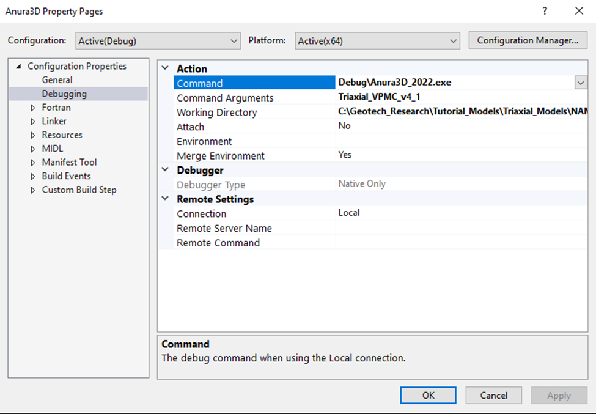
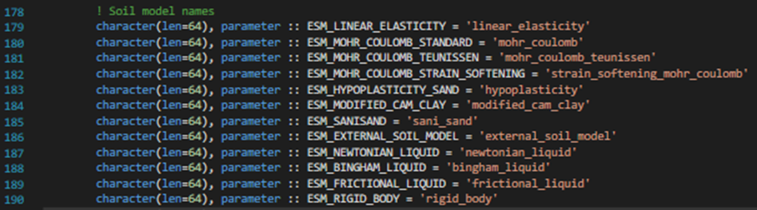
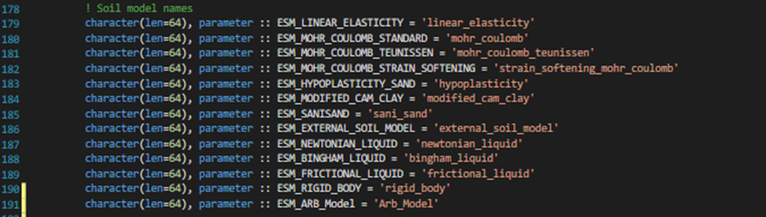
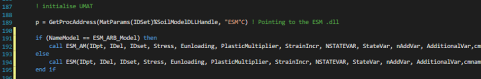
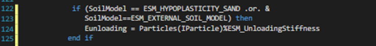
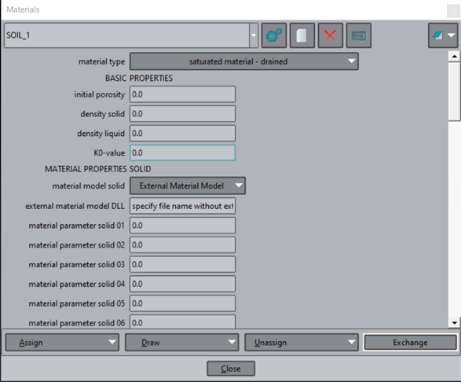
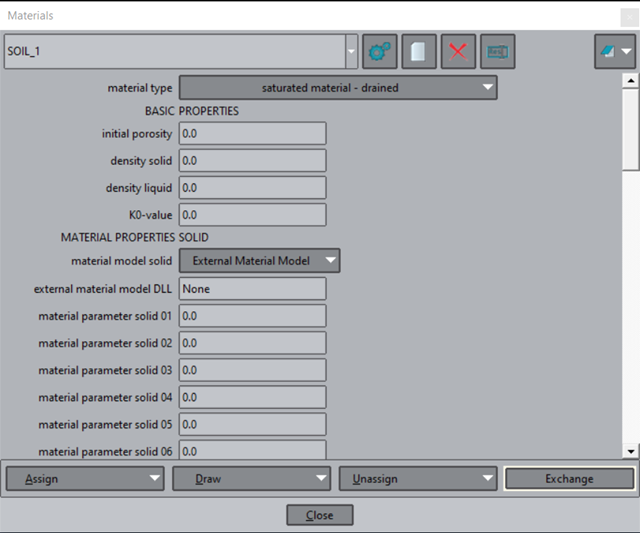

# Anura3D Help Guide

## Navigating to Anura3D executable after building
1)	Open Anura3D source folder in file manager
2)	Open “src” folder
3)	Open “VS” folder
4)	Open “Debug” folder
5)	Anura3D.exe is here

## Copying Anura3D.exe into GiD after building

Purpose:
After (re-)building the Anura3D executable the executable has to be given to GiD so that new models created from GiD are able to execute the new file with the new changes. 
Notes:
You can copy the executable into previously created folders and in the process delete the older version of Anura3D to use the new version of Anura3D for old models.
1)	Follow the directions in “Navigating to Anura3D executable after building”
2)	Copy the Anura3D.exe file
3)	Navigate to Program Files\GiD\GiD 14.0.1\problemtypes\Anura3D_2022.gid\exec
4)	Paste the executable

## Debugging Procedure

Command -> Debug\Anura3D_2022
Command Arguments -> CPS and GOM filename (ie. Triaxial_VPMC_v4_1)
Working Directory-> The directory to the folder you want to run
 

    

## Adding parameters to PAR file output

* Add the header to the subroutine InitialiseMaterialPointOutputFiles()
  * Make sure to add it to the 3D (case(3)) and 2D (case(2)) condition
  * Update the write(ParUnit+I, (‘Fortran # of spaces’)) so that ‘Fortran # of spaces’ is correct
* Update subroutine MaterialPointOutput()
  * If need be calc value
  * Increases the number of space in the write(ParUnit + I, …) condition so that the there are enough spaces of the right number type
  * Place the new value in the same order as the header created in the last step

## Adding  Flag to CPS file

* Add variable to ReadCalculationData for CalParamType. This will act as the flag variable
* Add the flag condition where necessary
* Add write condition to ReadCalculationData.For  condition so that the flag is written to subsequent CPS files (Done in the ReadCalculationData, module)

## Instructions to Hardcode an External Soil Model into Anura3D_2022 using the ExternalSoilModel.for file

### Introduction
The purpose of these instructions are to enable external soil models to be used without the need to use .dll files. The source code used is Anura3D 2022 version. The ExternalSoilModel (ESM) and UMAT subroutines are hard coded directly into the Anura3D source code. Five files need to be modified for this to work:
1)	GlobalConstants.for
2)	ExternalSoilModel.for
3)	MPMConvPhase.for
4)	ReadMaterialData.for
5)	.GOM file

These instructions are split into instructions for each of these files. The first four files that need to be are within the Anura3D solution (.sln) file. The fifth file, the GOM, is generated using GiD and is in the .A3D folder. For more information on the Anura3D.sln file, building the Anura3D file in Visual Studio, GiD, and the .A3D file please see the Anura3D tutorial manual.
For generality, the name of the soil model that will be implemented in these instructions is called “Arb_Model” and modifications to subroutine names will take on “_AM”. For your use case, feel free to change the names “Arb_Model” and “_AM” to be more specific. Line numbers are provided in these instructions, they should only be used as ballpark estimates as the line number in your solution may be different due to previous edits or use of a different version.

### GlobalConstants.for
#### Purpose
The purpose of this modification is to add a character variable to store the name of your “Arb_Model” External soil model subroutine (ESM file) to make future modifications simpler.
Instructions
1)	Open the GlobalConstants.for file in Visual Studio. The GlobalConstants.for file is in the “Shared” subfolder of the Anura3D solution.

2)	Scroll down to line 178 and look for the following comment and code block, Figure 1:

 

    

Figure 1. Soil model character name definitions

3)	Add a new character variable to store the name of your soil model. Figure 2.
 

    

Figure 2. Added character variable to store name of your soil model

4)	Write down/remember/copy the name of new ESM character variable.

5)	Save the changes. No more edits to the GlobalConstants.for file are needed.

### ExternalSoilModels.for
#### Purpose
The purpose of these modifications is to hard code your ESM and UMAT subroutine into the ExternalSoilModels.for file. 
Warning: Since the UMAT file is being included in the source code, sometimes subroutines/functions that are required for the UMAT have duplicate names as those already in Anura3D (ie. some UMATs use a subroutine called DotProduct, however DotProduct is an already defined subroutine in Anura3D). For convenience, the recommended option is to change the name of the subroutine in the UMAT to a name not already in use. For example, change the name of the DotProduct subroutine called by the UMAT file to DotProduct_2. This change will require changing both the name of the subroutine at the location of the call and where the subroutine is defined.

Instructions
1)	Open the ExternalSoilModel.for file in Visual Studio. The ExternalSoilModel.for file is located is in the “MaterialModel” subfolder of the Anura3D solution.

2)	Scroll down to the bottom of the ModExternalSoilModel module. Paste in your ESM subroutine/

3)	(Recommend) Change the variable definitions to implicit none and specify their intent (in/out/inout). This recommendation has been found to make debugging easier.

4)	Change the name of the ESM subroutine to something other than “ESM”. For example change the name to ESM_AM. This change needs to be made at the start and end of the subroutine (ie. Subroutine ESM_AM… end subroutine ESM_AM)
5)	¬¬After the end of the ESM_AM subroutine paste in the UMAT subroutine and any required subroutines and functions.

6)	Change the name of the UMAT subroutine to UMAT_AM at the start and end of the subroutine (ie. Subroutine UMAT_AM… end subroutine UMAT_AM)

7)	If the UMAT uses the ‘ABA_PARAM.INC’ file to define variables all variable definitions need to be updated. Change all variable definitions to implicit none and define the intent (in/out/inout) of all variables.

8)	Delete the line that says “Include ‘ABA_PARAM.INC’”

9)	Update the variable definitions and intent of variables used by the subroutines that the UMAT_AM file calls.

10)	Scroll up to line 189 and look for the following comment and code block, Figure 3:
 

    

Figure 3. Snip of original call the ESM in the .dll. Input variables into the ESM subroutine are cut off so that the figure is large enough to see.

11)	Create an if statement using the “NameModel” variable to catch if the input external soil model name is “Arb_Model”. Add an else statement in case the original method of including an external soil model is wanted, Figure 4.

    

 
Figure 4. Snip of if statement to catch if the input name of the model is ESM_ARB_Model.

12)	Save the changes to the ExternalSoilModel.for file. No more edits to this file are needed.

MPMConvPhase.for
Purpose
The purpose of this modification is to add a condition for the ESM_ARB_Model so that the time step is calculated correctly. 
Instructions
1)	Open the MPMConvPhase.for file in Visual Studio. The MPMConvPhase files is in the “MPMModules” subfolder of the Anura3D solution.
2)	Scroll down to line 122 and look for the following code block, Figure 5.
 

    

Figure 5. Existing if condition to define Eunloading for External Soil Models

3)	Update the if condition to include the option of “Arb_Model”, Figure 6.

 

    

 

Figure 6. Updated if condition so that SoilModel == ESM_ARB_Model is an option and Eunloading is correctly defined for hard coded model

4)	Save the changes to the MPMConvPhase.for file. No more edits to this file are needed.

### ReadMaterialData.for

#### Purpose
The purpose of this modification is to add an if condition, so that the material data is correctly read in from the .GOM file, when using ESM_ARB_Model.
Instructions
1)	Open the ReadMaterialData.for file in Visual Studio. The ReadMaterialData.for file is in the “InputModules” subfolder of the Anura3D solution.
2)	Scroll down to line 957 and look for the following code block, Figure 7.

    

 

Figure 7. External Soil model using .dll file data read in

3)	Copy all code in Figure 7. Paste the code below the “case(ESM_EXTERNAL_SOIL_MODEL)”

4)	To read the data in for the ESM_ARB_Model, we need to modify the copied and pasted code in the last step. All modifications will be to the pasted code.

5)	Change the name of the case to “case(ESM_ARB_Model)”

6)	Comment out or delete the code block that initializes the DLL, Figure 8.

    

 
Figure 8. Commented out code that would have initialized the DLL for a External Soil model not hard coded.

7)	Save the changes to the ReadMaterialData.for file. No more edits to this file are needed.
8)	As this was the last modification to the Anura3D.sln, please rebuild the solution and copy it into the correct folders as specified in the Anura3D tutorial manual.

### .GOM file
#### Purpose
The purpose of this modification is to specify in the .GOM file that ESM_ARB_Model should be used as the constitutive model. This process takes advantage of the material model solid: External Material Model selection in GiD.
Instructions
1)	Set the material model solid to External Material Model, Figure 9.
 

    

 

Figure 9. Selecting External Material Model in GiD
2)	The external material model DLL, Figure 10, specification is not used for this process. For convenience set it to “None”.

    

 

Figure 10. Specifying the DLL name as “None” for convenience.

3)	Generate the .A3D folder using GiD.
4)	Navigate to the generated .A3D folder and open the .GOM file
5)	Scroll down to the $$MATERIAL_MODEL_SOLID flag corresponding to the material you would like to use the ESM_ARB_Model with.
6)	Change the test below the $$MATERIAL_MODEL_SOLID flag to “Arb_Model”.
7)	Save the changes to the .GOM file. No more edits to this file are needed.
With that you’re done. You should now be able to use the hardcoded material model within Anura3D.
