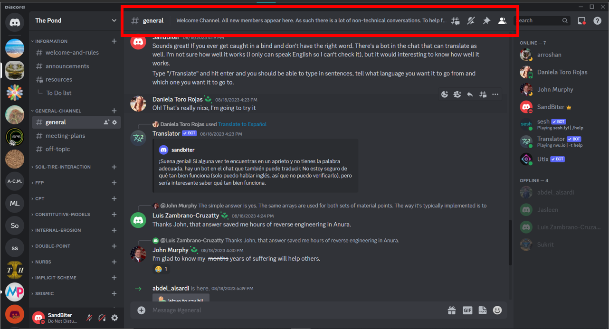
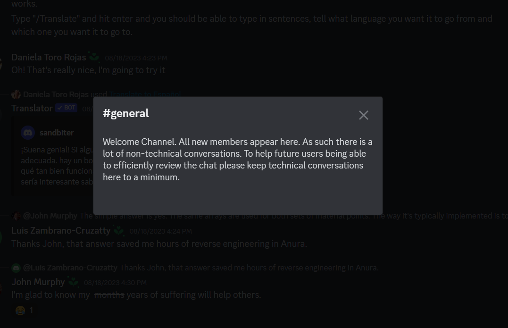
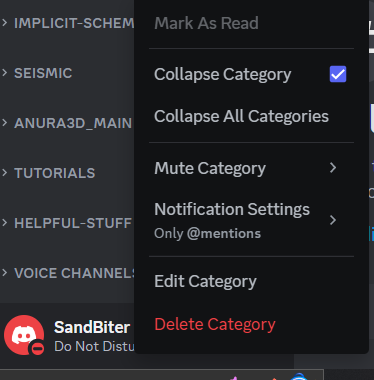
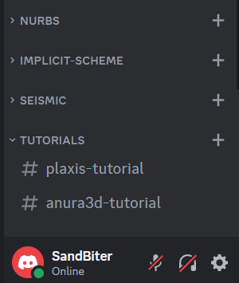

# General Info

## Purpose
The purpose of this documents is to provide a starting point to navigate through the GeoMPM VT Discord named **The Pond**. This will be in no way an exhaustive list of information. There is a ton of info on Discord on the internet, sometimes a little too much such that it becomes overwhelming. Therefore, this document will provide notes on key features of Discord with specific information to **The Pond** :frog:

## Purpose of **The Pond**
The purpose of **The Pond** is as follows:

1) Facilitate communication between current group members.
2) Create a living storage of information and files to support new students joining the group.
3) Gain access to more input for each project a member is working on and help inform group members about what everyone is wokring on.
4) Increase the rate at which new members become familar with numerical modelling and soil mechanics, including but not limited to:
   * Finite Element Method (FEM)
   * Material Point Method (MPM)
   * Github
   * Anura3D

## Categories vs. Channels
### Categories
A Category is basically a folder. It can contain Channels, be that audio or text. 

### Channels
Channels are the actual chat rooms or audio/video rooms. They can exist inside of Categories or independently in the server. (:warning:**All channels should be created inside a Category. This will help organization and scrolling**:warning:) All channels have a purpose. A short snippet about the purpose of the channel is located at the top of the channel (See below).

If you click on the snippet the full message appears (See below).

## General Operation
All memebers should be able to:
1) Create, modify, and delete categories and channels
2) Send messages, create threads, join and leave audio/video channels
3) Share informatino and iteract with bots

If any of those functions aren't working for you or if you have any questions please ask.

## Helpful links

### Getting started with Discord
General information on how to use Discord and some of it's features: [Link](https://support.discord.com/hc/en-us/articles/360045138571-Beginner-s-Guide-to-Discord).

### Linking Github with Discord
Quick video on using webhooks to integrate github notifications into a discord category.  Link: https://www.youtube.com/watch?v=-KDQqWNK3Tw. This can be used to track all events occuring on a discord (updates, issues, etc.)

### Writing Markdown text
The textbox for Discord largely includes basic markdown text capabilities. Markdown text allows you to send formatted text, images, and emojis in a easy way. It is the same format used in Markdown cells in Jupyter notebooks. This is a link on how to format things for Markdown:
[Link](https://docs.github.com/en/get-started/writing-on-github/getting-started-with-writing-and-formatting-on-github/basic-writing-and-formatting-syntax). It isn't necessary to use these functions, but it might be helpful (and I think it's kind of cool :sunglasses:).

### Building a Discord Bot
Longer form video on how to create a discord bot https://www.youtube.com/watch?v=SPTfmiYiuok

## FAQ

### 1) **Q)** Why is it called **The Pond**

   **A)** Anura in **Anura3D** means frog. So the creaters went along with the theme.
### 2) **Q)** Whats a Discord Bot and how do I use them?
   
   **A)** Discord Bots are scripts that people have written that add capabilities, make actions more effective, and personalize a Discord server. To interact with a bot type "**/**"  with out the "" and a list of options will show up; then you yype or select one of the options provided and hit enter. The bot will either preform its action right away or provide a way for you the user to interact with it so it can get some more information and perform its task.
### How can I stop getting so many notifications?
There's a three main ways to stop getting so many notifications.

The first option is to change your server notification settings.  

### To do so:
1) Click **The Pond** at the top right  
   

   The following menu should open up:  
      

2) Click **Notification Settings**  
   

3) Selecting **Only @mentions**,  means you'll only see updates when someone sends a message with **@"Your Profile Name"** (This is recommended). Selecting **Nothing** stops all notifications from this server only.  

---

The second option is to change the notification settings for a specific Category or channel.

### To do so:
1) Right click the Channel/Category you want to change the settings of. The following should open:
   

2) Click **Notification Settings**
   
4) Change the settings to what you want  

### Third option: Turn on Do not disturb. 
 This option has the disadvantage of stopping messages being delivered from all servers and from personal messages. 

#### To do this:

1) Click your user profile (Figure 1) in the bottom left. 

1) When you click on it the following menu should appear. 

1) Click the "Online button" 

1) Select "Do not disturb" 

