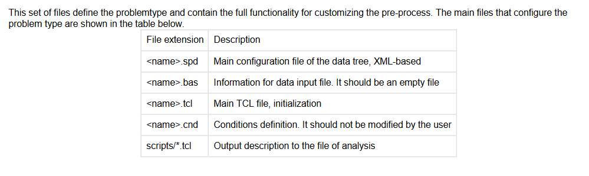

# Info on working with GiD Problem Types
The purpose of this document is to store information on making a GiD Problem Type

## Helpful links
[Link to Gid Manual on creating GiD Problem Types](https://gidsimulation.atlassian.net/wiki/spaces/GCM/pages/2385543180/INTRODUCTION)

## Gid PlugIns
Gid plugins are a way to add menu items to GiD for information on PlugIns check page 238 of GiD Customization manual (Plug-In Extensions)